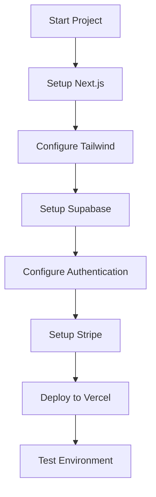
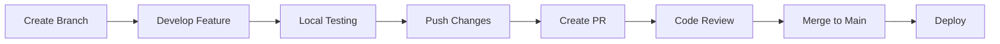
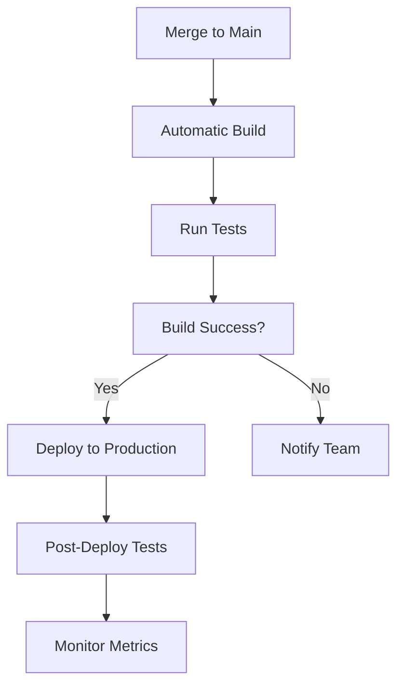
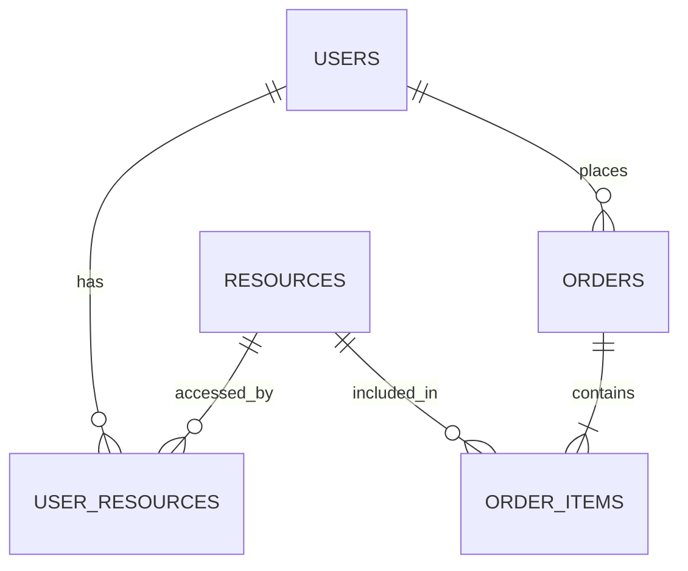

# Technical Documentation

## Contents
1. [Tech Stack](tech-stack.md)
   - Frontend framework
   - Backend services
   - Database
   - Third-party services

2. [Architecture](architecture.md)
   - System design
   - Data flow
   - Security implementation

3. [API Specifications](api-specifications.md)
   - Endpoints
   - Data models
   - Integration guides

# Visa Forte Design System

## Color Palette
### Primary Colors
- Deep Blue: #1E3A8A
  - Trust, professionalism, stability
  - Used for: Headers, primary buttons, important text

- Sky Blue: #0EA5E9
  - Clarity, progress, accessibility
  - Used for: Secondary elements, links, highlights

- Warm Orange: #F59E0B
  - Urgency, warmth, calls-to-action
  - Used for: CTAs, important buttons, highlights

### Background Colors
- Primary White: #FFFFFF
  - Clean, professional
  - Used for: Main background, cards

- Light Gray Blue: #F8FAFC
  - Subtle distinction
  - Used for: Secondary backgrounds, sections

### Text Colors
- Dark Slate: #1E293B
  - Primary text
  - Used for: Headings, important content

- Medium Slate: #475569
  - Secondary text
  - Used for: Body text, descriptions

- Light Text: #F8FAFC
  - Contrast text
  - Used for: Text on dark backgrounds

## Typography
### Fonts
- Headings: "Montserrat, sans-serif"
  - Clean, modern, authoritative
  - Weights: 600 (semibold), 700 (bold)

- Body: "Inter, sans-serif"
  - Highly legible, modern
  - Weights: 400 (regular), 500 (medium)

### Size Scale
- H1: 3rem/48px
  - Used for: Main headlines
  - Line height: 1.2

- H2: 2.25rem/36px
  - Used for: Section headers
  - Line height: 1.2

- H3: 1.5rem/24px
  - Used for: Subsections
  - Line height: 1.3

- Body: 1rem/16px
  - Used for: Main content
  - Line height: 1.6

- Small: 0.875rem/14px
  - Used for: Captions, metadata
  - Line height: 1.4

## Components
### Buttons
1. Primary Button
```html
<button class="bg-[#F59E0B] hover:bg-[#D97706] text-white px-8 py-4 rounded-lg">
  Primary Action
</button>
```

2. Secondary Button
```html
<button class="border-2 border-[#1E3A8A] text-[#1E3A8A] hover:bg-[#1E3A8A] hover:text-white px-6 py-3 rounded-lg">
  Secondary Action
</button>
```

### Cards
1. Resource Card
```html
<div class="bg-white rounded-xl shadow-lg p-6">
  <h3 class="text-[#1E293B] text-xl font-semibold">Title</h3>
  <p class="text-[#475569] mt-2">Description</p>
  <div class="mt-4">Price/CTA</div>
</div>
```

2. Tool Card
```html
<div class="bg-[#F8FAFC] rounded-xl p-6 border border-gray-200">
  <h3 class="text-[#1E293B] text-xl font-semibold">Calculator Name</h3>
  <p class="text-[#475569] mt-2">Description</p>
  <button class="mt-4">Use Tool</button>
</div>
```

### Forms
1. Input Fields
```html
<input 
  class="w-full px-4 py-2 border border-gray-300 rounded-lg focus:ring-2 focus:ring-[#0EA5E9] focus:border-transparent"
  type="text"
/>
```

2. Select Dropdowns
```html
<select class="w-full px-4 py-2 border border-gray-300 rounded-lg bg-white">
  <option>Select option</option>
</select>
```

## Layout
### Grid System
- Container max-width: 1200px
- Grid columns: 12
- Gutters: 24px
- Breakpoints:
  - Mobile: 320px
  - Tablet: 768px
  - Desktop: 1200px

### Spacing Scale
- xs: 0.25rem (4px)
- sm: 0.5rem (8px)
- md: 1rem (16px)
- lg: 1.5rem (24px)
- xl: 2rem (32px)
- 2xl: 3rem (48px)

## Icons
- Using Hero Icons library
- Size guidelines:
  - Navigation: 24px
  - Buttons: 20px
  - Inline: 16px
  - Small UI: 12px

## Animations
### Transitions
- Default: 150ms ease-in-out
- Hover states: 200ms ease
- Page transitions: 300ms ease

### Hover States
- Buttons: Scale 1.02
- Cards: Slight shadow increase
- Links: Underline animation   

# Content Templates

## Guide Templates
### Immigration Guide Structure
```markdown
# [Program Name] Guide

## Overview
- Brief program description
- Key eligibility criteria
- Processing time
- Success rate

## Requirements
- Age requirements
- Education requirements
- Work experience
- Language proficiency
- Financial requirements

## Step-by-Step Process
1. Eligibility Assessment
2. Document Preparation
3. Application Submission
4. Processing and Updates
5. Final Steps

## Document Checklist
- Required documents
- Format specifications
- Translation requirements
- Additional supporting documents

## Tips & Best Practices
- Common mistakes to avoid
- Success strategies
- Timeline management
- Expert recommendations

## FAQs
- Common questions
- Expert answers
- Additional resources
- Support options
```

### Document Template Structure
```markdown
# [Document Type]

## Purpose
[Brief explanation of document's purpose]

## Format Requirements
- Paper size
- Font specifications
- Margins
- Special requirements

## Content Structure
[Template content with placeholders]

## Sample Text
[Example content]

## Instructions
1. Step-by-step guide
2. Important notes
3. Common mistakes
4. Tips

## Verification Checklist
- [ ] Format requirements met
- [ ] Content complete
- [ ] Signatures included
- [ ] Supporting documents attached
```

## Email Templates
### Consultation Booking
```
Subject: Your Visa Forte Consultation Confirmation

Dear [Name],

Thank you for booking a consultation with Visa Forte.

Consultation Details:
- Date: [Date]
- Time: [Time]
- Duration: [Duration]
- Type: [Consultation Type]

Please prepare:
1. [Document 1]
2. [Document 2]
3. [Questions]

[Join link/Phone number]

Best regards,
Visa Forte Team
```

### Resource Purchase
```
Subject: Your Visa Forte Resources Are Ready

Dear [Name],

Thank you for purchasing [Resource Name].

Access Your Resources:
- Download Link: [Link]
- Access Code: [Code]
- Expiry: [Date]

Getting Started:
1. Download your resources
2. Review the guide
3. Follow the checklist

Need help? [Support contact]

Best regards,
Visa Forte Team
```

## Blog Post Template
```markdown
# [Title]

## Introduction
- Hook
- Context
- Value proposition

## Main Content
### Section 1
- Key point
- Supporting details
- Examples

### Section 2
- Key point
- Supporting details
- Examples

## Practical Tips
1. Tip one
2. Tip two
3. Tip three

## Conclusion
- Summary
- Call to action
- Next steps

## Resources
- Related guides
- Useful tools
- Additional reading
```

## Social Media Templates
### LinkedIn Posts
```
🌟 [Attention-grabbing headline]

💡 Key insight about Canadian immigration

🔑 Main points:
• Point 1
• Point 2
• Point 3

🎯 How this helps you:
[Benefit statement]

🔗 Learn more: [Link]

#CanadianImmigration #VisaForte
```

### Instagram Posts
```
📢 [Compelling title]

✨ Quick immigration tip:
[Main content]

💪 Why this matters:
[Impact statement]

🎯 Next steps:
[Call to action]

#CanadianVisa #ImmigrationTips
```

## Newsletter Template
```
Subject: [Topic] - Visa Forte Immigration Updates

Header:
- Main story
- Key updates

Body:
1. Immigration News
   - Latest updates
   - Policy changes
   - Processing times

2. Tips & Insights
   - Expert advice
   - Success stories
   - Best practices

3. Resources
   - New guides
   - Updated tools
   - Special offers

Footer:
- Contact information
- Social media links
- Unsubscribe option
```

Would you like me to:
1. Create the pricing guide documentation next?
2. Add more template variations?
3. Create resource structure documentation?
4. Add specific examples for each template?

Let me know how you'd like to proceed with the next documentation files!   

# Visa Forte Pricing Guide

## Resource Pricing Structure

### Individual Guides
1. Express Entry Guide
   - Base Price: $49
   - Includes:
     - Comprehensive guide (50+ pages)
     - Basic templates
     - 3 months access
     - Updates included

2. Provincial Nomination Guide
   - Base Price: $39
   - Includes:
     - Program-specific guide
     - Basic templates
     - 3 months access
     - Updates included

3. Student Visa Guide
   - Base Price: $29
   - Includes:
     - Study permit guide
     - Basic templates
     - 3 months access
     - Updates included

4. Work Permit Guide
   - Base Price: $34
   - Includes:
     - Work permit guide
     - Basic templates
     - 3 months access
     - Updates included

### Document Template Bundles
1. Professional Bundle
   - Price: $79
   - Includes:
     - Reference Letters (5 templates)
     - Employment Letters (3 templates)
     - Job Offer Letters (2 templates)
     - Resignation Letters (2 templates)
     - Lifetime access

2. Education Bundle
   - Price: $59
   - Includes:
     - Statement of Purpose (3 templates)
     - Letter of Explanation (4 templates)
     - Academic References (3 templates)
     - Research Proposals (2 templates)
     - Lifetime access

3. Financial Bundle
   - Price: $49
   - Includes:
     - Bank Statement Formats
     - Affidavit of Support
     - Financial Undertaking
     - Asset Declaration
     - Lifetime access

4. Personal Bundle
   - Price: $39
   - Includes:
     - Cover Letters
     - Resume Templates
     - Personal Statements
     - Travel History Format
     - Lifetime access

### Comprehensive Packages
1. Express Entry Complete Package
   - Price: $149
   - Includes:
     - Express Entry Guide
     - All document templates
     - 6 months access
     - Email support
     - Updates included

2. Student Success Package
   - Price: $99
   - Includes:
     - Student Visa Guide
     - Education Bundle
     - Personal Bundle
     - 6 months access
     - Updates included

3. Professional Package
   - Price: $129
   - Includes:
     - Work Permit Guide
     - Professional Bundle
     - Financial Bundle
     - 6 months access
     - Updates included

## Consultation Pricing

### One-on-One Consultations
1. Quick Assessment
   - Duration: 30 minutes
   - Price: $49
   - Focus: Initial eligibility check

2. Detailed Consultation
   - Duration: 60 minutes
   - Price: $89
   - Focus: In-depth program discussion

3. Document Review
   - Duration: 45 minutes
   - Price: $69
   - Focus: Application review

### Consultation Packages
1. Complete Assessment Package
   - Price: $159
   - Includes:
     - 60-minute initial consultation
     - 30-minute follow-up
     - Email support (1 week)
     - Basic document review

2. Application Support Package
   - Price: $249
   - Includes:
     - 60-minute strategy session
     - Two 30-minute follow-ups
     - Document review
     - Email support (2 weeks)

## Special Offers

### Bundle Discounts
1. Multi-Guide Discount
   - 2 guides: 10% off
   - 3 guides: 15% off
   - 4+ guides: 20% off

2. Package Upgrades
   - Add consultation to any package: 20% off
   - Add templates to any guide: 15% off

### Seasonal Promotions
1. Early Bird Offers
   - New guide launches: 25% off first week
   - Package pre-orders: 20% off

2. Holiday Specials
   - Black Friday: 30% off all products
   - Christmas: 25% off packages
   - New Year: 20% off consultations

## Payment Options
1. One-Time Payment
   - Full access immediately
   - All major credit cards
   - PayPal accepted

2. Split Payment (for packages over $100)
   - Two installments
   - 50% upfront
   - 50% after 30 days

## Refund Policy
1. Digital Products
   - 7-day money-back guarantee
   - Must not have downloaded resources
   - One refund per customer

2. Consultations
   - 24-hour cancellation policy
   - Reschedule up to 2 times
   - No refunds after consultation

## Access Duration
1. Individual Guides
   - 3 months standard access
   - Extension option: $19/month

2. Template Bundles
   - Lifetime access
   - Free updates included

3. Packages
   - 6 months standard access
   - Extension option: $29/month

## Support Options
1. Basic Support (Included)
   - Email support
   - Response within 48 hours
   - Basic troubleshooting

2. Priority Support (Add-on)
   - Price: $29/month
   - Email support
   - Response within 12 hours
   - Direct chat support

Would you like me to:
1. Create the resource structure documentation next?
2. Add more pricing tiers or options?
3. Create promotional campaign templates?
4. Develop a pricing strategy guide?

Let me know how you'd like to proceed with the next documentation!   

# Resource Structure Documentation

## Resource Categories & Organization

### 1. Immigration Guides
#### Express Entry Resources
- Complete Program Guide
  ```
  /resources/express-entry/
  ├── guide/
  │   ├── program-overview.pdf
  │   ├── eligibility-requirements.pdf
  │   ├── step-by-step-process.pdf
  │   ├── document-checklist.pdf
  │   └── tips-and-strategies.pdf
  ├── templates/
  │   ├── reference-letters/
  │   ├── employment-letters/
  │   └── supporting-documents/
  └── tools/
      ├── crs-calculator.html
      ├── eligibility-checker.html
      └── timeline-planner.html
  ```

#### Provincial Nomination Program
- PNP Guide Structure
  ```
  /resources/pnp/
  ├── guide/
  │   ├── program-overview.pdf
  │   ├── province-comparison.pdf
  │   ├── eligibility-by-province.pdf
  │   └── application-process.pdf
  ├── templates/
  │   ├── nomination-documents/
  │   ├── job-offers/
  │   └── provincial-forms/
  └── tools/
      ├── province-selector.html
      ├── points-calculator.html
      └── requirement-checker.html
  ```

### 2. Document Templates
#### Professional Documents
```bash
# Create and populate Documentation\Resources\resource-structure.md
```
/resources/templates/professional/
├── reference-letters/
│   ├── employer-reference.docx
│   ├── skill-reference.docx
│   └── character-reference.docx
├── employment-letters/
│   ├── job-offer.docx
│   ├── employment-confirmation.docx
│   └── work-experience.docx
└── business-documents/
    ├── business-plan.docx
    ├── financial-statements.xlsx
    └── company-profile.docx
```

#### Educational Documents
```
/resources/templates/education/
├── academic/
│   ├── statement-of-purpose.docx
│   ├── research-proposal.docx
│   └── academic-reference.docx
├── transcripts/
│   ├── transcript-request.docx
│   └── evaluation-request.docx
└── supporting/
    ├── study-plan.docx
    └── financial-plan.xlsx
```

### 3. Tools & Calculators
#### Assessment Tools
```
/resources/tools/
├── calculators/
│   ├── crs-calculator/
│   ├── eligibility-checker/
│   └── cost-calculator/
├── timelines/
│   ├── process-estimator/
│   └── deadline-tracker/
└── comparisons/
    ├── program-comparison/
    └── province-comparison/
```

### 4. Settlement Resources
#### Pre-Landing Resources
```
/resources/settlement/pre-landing/
├── checklists/
│   ├── documentation.pdf
│   ├── travel-arrangements.pdf
│   └── initial-funds.pdf
├── guides/
│   ├── airport-arrival.pdf
│   ├── temporary-accommodation.pdf
│   └── essential-services.pdf
└── forms/
    ├── customs-declaration.pdf
    └── arrival-information.pdf
```

#### Post-Landing Resources
```
/resources/settlement/post-landing/
├── essential-setup/
│   ├── sin-application.pdf
│   ├── health-insurance.pdf
│   └── banking-guide.pdf
├── housing/
│   ├── rental-guide.pdf
│   ├── lease-templates.pdf
│   └── utility-setup.pdf
└── employment/
    ├── job-search.pdf
    ├── resume-templates.pdf
    └── interview-guide.pdf
```

## Access Levels & Permissions

### 1. Free Access
- Basic eligibility checker
- Sample templates preview
- General immigration information
- Basic calculators

### 2. Basic Purchase
- Individual guides
- Basic templates
- Standard calculators
- 3-month access

### 3. Premium Purchase
- Complete guide packages
- All templates
- Advanced tools
- 6-month access
- Priority support

### 4. Consultation Clients
- All purchased resources
- Consultation recordings
- Custom documents
- Extended access
- Direct support

## Resource Delivery System

### 1. Digital Delivery
- Secure download links
- Access expiration tracking
- Download limits
- Update notifications

### 2. Access Management
- User dashboard
- Resource library
- Download history
- Access renewal options

### 3. Update System
- Version control
- Update notifications
- Changelog
- Access extension options

## Resource Maintenance

### 1. Update Schedule
- Monthly content review
- Quarterly updates
- Annual overhaul
- Immigration changes tracking

### 2. Quality Control
- Accuracy verification
- Format checking
- Link validation
- User feedback integration

### 3. Version Control
- Document versioning
- Update tracking
- Change documentation
- Archive system

## Support Structure

### 1. Resource Support
- Usage guidelines
- FAQ documentation
- Video tutorials
- Help documentation

### 2. Technical Support
- Access issues
- Download problems
- Format compatibility
- Platform navigation

### 3. Content Support
- Clarifications
- Updates
- Customization requests
- Feedback handling
```

Would you like me to:
1. Add more detailed structure for specific resources?
2. Create user journey maps for resource access?
3. Develop resource maintenance guidelines?
4. Create resource update protocols?

Let me know how you'd like to proceed with the next documentation!   

# User Journey Maps

## First-Time Visitor Journey

### 1. Discovery Phase
- Entry Points
  - Google Search
  - Social Media
  - Referrals
  
- Initial Interactions
  1. Landing Page
     - Value proposition
     - Trust indicators
     - Free resources preview
  
  2. Tool Exploration
     - Basic eligibility check
     - CRS calculator
     - Cost estimator

### 2. Engagement Phase
- Free Resource Access
  1. Newsletter signup
  2. Sample guide download
  3. Basic tool usage

- Information Gathering
  1. Program information review
  2. Resource catalog browsing
  3. Pricing comparison

### 3. Conversion Phase
- Purchase Decision Points
  1. Guide selection
  2. Bundle consideration
  3. Checkout process
  
- Post-Purchase
  1. Account creation
  2. Resource access
  3. Welcome email sequence

## Returning User Journey

### 1. Resource Access
- Login Process
  1. Dashboard access
  2. Resource library
  3. Downloaded items

- Resource Utilization
  1. Guide reading
  2. Template downloads
  3. Tool usage

### 2. Support Touchpoints
- Help Access
  1. FAQ consultation
  2. Support tickets
  3. Live chat

- Resource Updates
  1. Update notifications
  2. New content alerts
  3. Extension reminders

## Consultation Client Journey

### 1. Pre-Consultation
- Booking Process
  1. Schedule selection
  2. Payment
  3. Preparation guide

- Document Preparation
  1. Checklist review
  2. Document gathering
  3. Question preparation

### 2. Consultation
- Meeting Flow
  1. Introduction
  2. Assessment
  3. Recommendations
  4. Next steps

### 3. Post-Consultation
- Follow-up
  1. Meeting summary
  2. Resource recommendations
  3. Action items

## User Interaction Points

### 1. Website Navigation
- Header Menu
  ```
  Home → Services → Resources → Tools → Contact
  ```

- Resource Library
  ```
  Categories → Subcategories → Individual Resources
  ```

### 2. Tool Integration
- Calculator Flow
  ```
  Input → Calculation → Results → Recommendations → Resource Suggestions
  ```

- Document Generator
  ```
  Template Selection → Customization → Preview → Download
  ```

### 3. Purchase Flow
- Guide Purchase
  ```
  Selection → Cart → Checkout → Payment → Access
  ```

- Bundle Purchase
  ```
  Bundle Selection → Customization → Checkout → Payment → Access
  ```

## Optimization Points

### 1. Conversion Optimization
- Key Decision Points
  1. Free tool usage
  2. Guide preview
  3. Pricing comparison
  4. Bundle selection

- Trust Building
  1. Testimonials
  2. Success stories
  3. Expert credentials
  4. Money-back guarantee

### 2. Retention Optimization
- Engagement Points
  1. Email sequences
  2. Update notifications
  3. Resource recommendations
  4. Support touchpoints

- Value Addition
  1. Bonus content
  2. Extended access
  3. Special offers
  4. Priority support
```

# Resource Maintenance Guidelines

## Regular Update Schedule

### 1. Daily Checks
- Website functionality
- Download links
- Payment system
- User access

### 2. Weekly Updates
- Immigration news monitoring
- User feedback review
- Support ticket analysis
- Content accuracy check

### 3. Monthly Updates
- Content freshness review
- Tool accuracy verification
- Template updates
- FAQ updates

### 4. Quarterly Reviews
- Comprehensive content audit
- User journey optimization
- Pricing strategy review
- Bundle composition review

## Content Update Protocols

### 1. Immigration Updates
- Monitor Sources
  - IRCC website
  - Official newsletters
  - Policy changes
  - Processing times

- Update Process
  1. Change identification
  2. Content review
  3. Update drafting
  4. Peer review
  5. Implementation
  6. User notification

### 2. Document Templates
- Regular Review
  1. Format check
  2. Content accuracy
  3. User feedback integration
  4. Success rate analysis

- Update Implementation
  1. Template revision
  2. Testing
  3. Version control
  4. Distribution

### 3. Tools & Calculators
- Accuracy Verification
  1. Calculation check
  2. Data validation
  3. Result accuracy
  4. User testing

- Maintenance Tasks
  1. Algorithm updates
  2. Interface optimization
  3. Performance check
  4. Error logging

## Quality Assurance

### 1. Content Quality
- Accuracy Checks
  1. Information verification
  2. Source validation
  3. Expert review
  4. User feedback

- Format Consistency
  1. Style guide compliance
  2. Brand alignment
  3. Layout consistency
  4. Mobile responsiveness

### 2. Technical Quality
- Functionality Testing
  1. Download testing
  2. Access verification
  3. Tool testing
  4. Integration checks

- Performance Monitoring
  1. Load time
  2. Error rates
  3. User experience
  4. System stability

## Version Control

### 1. Document Versioning
- Version Naming
  ```
  YYYY.MM.V (e.g., 2024.03.1)
  ```

- Change Documentation
  1. Version history
  2. Change log
  3. Update notes
  4. User notifications

### 2. Archive Management
- Archive System
  1. Previous versions
  2. Change history
  3. Access logs
  4. User data

- Retention Policy
  1. Version retention
  2. Access history
  3. User records
  4. Support logs

## Emergency Updates

### 1. Critical Changes
- Identification
  1. Policy changes
  2. Legal updates
  3. Security issues
  4. Critical errors

- Implementation
  1. Rapid response
  2. User notification
  3. Support preparation
  4. Documentation

### 2. Update Distribution
- Communication Plan
  1. User notification
  2. Support brief
  3. Documentation update
  4. Follow-up verification

## Feedback Integration

### 1. User Feedback
- Collection Methods
  1. Surveys
  2. Support tickets
  3. User reviews
  4. Usage analytics

- Implementation Process
  1. Feedback analysis
  2. Priority assessment
  3. Update planning
  4. Implementation

### 2. Performance Metrics
- Tracking
  1. User satisfaction
  2. Resource usage
  3. Support tickets
  4. Success rates

- Optimization
  1. Content updates
  2. Process improvement
  3. User experience
  4. Support enhancement
```

# Workflow Diagrams & Implementation Guides

## 1. Development Workflows

### Initial Setup Workflow


### Feature Development Flow


## 2. Implementation Guides

### Phase 1: Core Setup
1. Next.js Setup
```bash
# Create new Next.js project
npx create-next-app@latest visaforte --typescript --tailwind --app

# Install core dependencies
npm install @supabase/supabase-js next-auth @stripe/stripe-js zustand
```

2. Environment Configuration
```env
# .env.local
NEXT_PUBLIC_SUPABASE_URL=your_supabase_url
NEXT_PUBLIC_SUPABASE_ANON_KEY=your_supabase_key
STRIPE_SECRET_KEY=your_stripe_key
NEXTAUTH_SECRET=your_nextauth_secret
```

3. Project Structure
```bash
# Create and populate Documentation\Development\workflow-diagrams.md
```
src/
├── app/
│   ├── layout.tsx
│   ├── page.tsx
│   └── providers.tsx
├── components/
│   ├── ui/
│   ├── forms/
│   └── shared/
├── lib/
│   ├── supabase.ts
│   ├── stripe.ts
│   └── auth.ts
└── styles/
    └── globals.css
```

### Phase 2: Feature Implementation

#### Resource System Setup
1. Database Schema
```sql
-- resources table
CREATE TABLE resources (
  id UUID PRIMARY KEY DEFAULT uuid_generate_v4(),
  title TEXT NOT NULL,
  description TEXT,
  type TEXT NOT NULL,
  price DECIMAL(10,2),
  created_at TIMESTAMP WITH TIME ZONE DEFAULT CURRENT_TIMESTAMP
);

-- user_resources table
CREATE TABLE user_resources (
  user_id UUID REFERENCES auth.users(id),
  resource_id UUID REFERENCES resources(id),
  purchased_at TIMESTAMP WITH TIME ZONE DEFAULT CURRENT_TIMESTAMP,
  expires_at TIMESTAMP WITH TIME ZONE,
  PRIMARY KEY (user_id, resource_id)
);
```

2. API Routes
```typescript
// app/api/resources/route.ts
import { createRouteHandlerClient } from '@supabase/auth-helpers-nextjs'
import { NextResponse } from 'next/server'

export async function GET() {
  const supabase = createRouteHandlerClient({ cookies })
  const { data, error } = await supabase
    .from('resources')
    .select('*')
  
  if (error) return NextResponse.json({ error }, { status: 500 })
  return NextResponse.json(data)
}
```

#### Payment Integration
```typescript
// lib/stripe.ts
import Stripe from 'stripe'

export const stripe = new Stripe(process.env.STRIPE_SECRET_KEY!, {
  apiVersion: '2023-10-16'
})

export async function createCheckoutSession(resourceId: string) {
  const session = await stripe.checkout.sessions.create({
    payment_method_types: ['card'],
    line_items: [
      {
        price_data: {
          currency: 'usd',
          product_data: {
            name: 'Resource Access',
          },
          unit_amount: 4900, // $49.00
        },
        quantity: 1,
      },
    ],
    mode: 'payment',
    success_url: `${process.env.NEXT_PUBLIC_URL}/success?session_id={CHECKOUT_SESSION_ID}`,
    cancel_url: `${process.env.NEXT_PUBLIC_URL}/canceled`,
  })
  
  return session
}
```

### Phase 3: Tool Implementation

#### Calculator Component Example
```typescript
// components/tools/CrsCalculator.tsx
'use client'

import { useState } from 'react'
import { calculateCrsScore } from '@/lib/calculations'

export function CrsCalculator() {
  const [formData, setFormData] = useState({
    age: '',
    education: '',
    experience: '',
    language: ''
  })
  
  const [score, setScore] = useState<number | null>(null)
  
  const handleCalculate = () => {
    const result = calculateCrsScore(formData)
    setScore(result)
  }
  
  return (
    <div className="p-6 bg-white rounded-lg shadow">
      {/* Form implementation */}
    </div>
  )
}
```

### Phase 4: Testing Implementation

1. Unit Testing Setup
```bash
# Install testing dependencies
npm install -D jest @testing-library/react @testing-library/jest-dom
```

2. Test Example
```typescript
// __tests__/CrsCalculator.test.tsx
import { render, screen, fireEvent } from '@testing-library/react'
import { CrsCalculator } from '@/components/tools/CrsCalculator'

describe('CrsCalculator', () => {
  it('calculates score correctly', () => {
    render(<CrsCalculator />)
    
    // Fill form
    fireEvent.change(screen.getByLabelText(/age/i), {
      target: { value: '30' },
    })
    
    // Trigger calculation
    fireEvent.click(screen.getByText(/calculate/i))
    
    // Check result
    expect(screen.getByText(/your score/i)).toBeInTheDocument()
  })
})
```

## 3. Deployment Workflow

### Production Deployment


### Monitoring Setup
1. Error Tracking
```typescript
// lib/monitoring.ts
export function initializeMonitoring() {
  // Basic error tracking
  window.onerror = function(msg, url, lineNo, columnNo, error) {
    console.error('Error: ', msg, url, lineNo, columnNo, error)
    // Add your error reporting service here
    return false
  }
}
```

Would you like me to:
1. Create more detailed implementation guides?
2. Add specific component examples?
3. Create database schema diagrams?
4. Develop API documentation?

Let me know how you'd like to proceed with the next documentation steps!

# API Documentation

## API Endpoints Structure

### Authentication Endpoints
```typescript
// POST /api/auth/register
{
  endpoint: "/api/auth/register",
  method: "POST",
  body: {
    email: string,
    password: string,
    name: string
  },
  responses: {
    200: { message: "User registered successfully" },
    400: { error: "Invalid input" },
    409: { error: "Email already exists" }
  }
}

// POST /api/auth/login
{
  endpoint: "/api/auth/login",
  method: "POST",
  body: {
    email: string,
    password: string
  },
  responses: {
    200: { token: "JWT_TOKEN" },
    401: { error: "Invalid credentials" }
  }
}
```

### Resource Endpoints
```typescript
// GET /api/resources
{
  endpoint: "/api/resources",
  method: "GET",
  query: {
    type?: string,
    category?: string,
    page?: number,
    limit?: number
  },
  responses: {
    200: Resource[],
    401: { error: "Unauthorized" }
  }
}

// GET /api/resources/:id
{
  endpoint: "/api/resources/:id",
  method: "GET",
  params: {
    id: string
  },
  responses: {
    200: Resource,
    404: { error: "Resource not found" }
  }
}
```

### Payment Endpoints
```typescript
// POST /api/payments/create-session
{
  endpoint: "/api/payments/create-session",
  method: "POST",
  body: {
    resourceId: string,
    quantity: number
  },
  responses: {
    200: { sessionId: string, url: string },
    400: { error: "Invalid input" }
  }
}
```

### User Resource Access
```typescript
// GET /api/user/resources
{
  endpoint: "/api/user/resources",
  method: "GET",
  headers: {
    Authorization: "Bearer TOKEN"
  },
  responses: {
    200: UserResource[],
    401: { error: "Unauthorized" }
  }
}
```

## Database Schema

```bash
# Create and populate Documentation\Technical\database-schema.md
```
```markdown
# Database Schema

## Core Tables

### Users
```sql
CREATE TABLE users (
  id UUID PRIMARY KEY DEFAULT uuid_generate_v4(),
  email TEXT UNIQUE NOT NULL,
  name TEXT,
  created_at TIMESTAMP WITH TIME ZONE DEFAULT CURRENT_TIMESTAMP,
  last_login TIMESTAMP WITH TIME ZONE,
  subscription_status TEXT DEFAULT 'free',
  metadata JSONB
);
```

### Resources
```sql
CREATE TABLE resources (
  id UUID PRIMARY KEY DEFAULT uuid_generate_v4(),
  title TEXT NOT NULL,
  description TEXT,
  type TEXT NOT NULL,
  category TEXT NOT NULL,
  price DECIMAL(10,2),
  access_duration INTERVAL,
  content_url TEXT,
  metadata JSONB,
  created_at TIMESTAMP WITH TIME ZONE DEFAULT CURRENT_TIMESTAMP,
  updated_at TIMESTAMP WITH TIME ZONE DEFAULT CURRENT_TIMESTAMP
);
```

### User Resources
```sql
CREATE TABLE user_resources (
  user_id UUID REFERENCES users(id),
  resource_id UUID REFERENCES resources(id),
  purchased_at TIMESTAMP WITH TIME ZONE DEFAULT CURRENT_TIMESTAMP,
  expires_at TIMESTAMP WITH TIME ZONE,
  access_count INTEGER DEFAULT 0,
  last_accessed TIMESTAMP WITH TIME ZONE,
  PRIMARY KEY (user_id, resource_id)
);
```

### Orders
```sql
CREATE TABLE orders (
  id UUID PRIMARY KEY DEFAULT uuid_generate_v4(),
  user_id UUID REFERENCES users(id),
  amount DECIMAL(10,2) NOT NULL,
  status TEXT NOT NULL,
  payment_intent_id TEXT UNIQUE,
  created_at TIMESTAMP WITH TIME ZONE DEFAULT CURRENT_TIMESTAMP,
  metadata JSONB
);
```

### Order Items
```sql
CREATE TABLE order_items (
  order_id UUID REFERENCES orders(id),
  resource_id UUID REFERENCES resources(id),
  quantity INTEGER NOT NULL,
  price_at_time DECIMAL(10,2) NOT NULL,
  PRIMARY KEY (order_id, resource_id)
);
```

## Relationships Diagram


## Final Documentation Structure